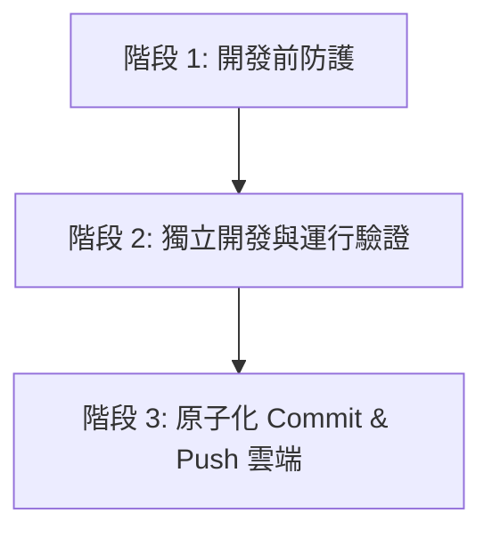

# 通用開發與 Git 版本控制標準規範 (Universal Git & Development Standard)

本文件定義此專案（以及未來所有擴充計劃）必須嚴格遵守的開發流程與 Git 版本控制標準規範。

---

## 🎯 核心原則

1. **零數據遺失 (Zero Data Loss)**：任何對原始資料、關鍵邏輯或使用者自訂內容的修改，必須有歷史紀錄可還原。
2. **驗證後提交 (Verify Before Commit)**：編輯代碼後必須通過實體運行驗證，確定 0 語法錯誤、0 畫面崩潰，方可 Commit。
3. **雲端即時同步 (Real-time Cloud Sync)**：本地 Commit 驗證完成後，必須同步 Push 到 GitHub 遠端專案庫。

---

## 📋 開發三階段標準作業流程 (SOP)



### 階段 1：開發前防護 (Pre-Development)
- **檢查工作區狀態**：執行 `git status`，確保目前沒有未存檔的懸空變更。
- **重大變更打 Tag / 開分支**：涉及重大重構或資料結構調整時，先建立備份標籤：
  ```bash
  git tag v1.X-before-refactor
  ```

### 階段 2：開發與測試驗證 (Development & Verification)
- **精準編輯**：保留既有 API 規格與架構，禁止盲目覆寫已有資料。
- **強制執行測試**：編輯完畢後，必須執行自動化驗證指令（如 `node test_in_jsdom.js` 或系統測試），確認主介面與數據全數正常。

### 階段 3：提交與雲端同步 (Commit & Push)
- **格式化提交訊息 (Conventional Commits)**：
  ```bash
  git add .
  git commit -m "<type>: <明確的修改說明>"
  ```
  - `feat:` 新增功能 (例如: `feat: 新增編輯與刪除食譜按鈕`)
  - `fix:` 錯誤修復 (例如: `fix: 修復 Script 標籤轉譯導致之白屏問題`)
  - `data:` 數據處理 (例如: `data: 匯入不萊嗯 459 道結構化食譜`)
  - `docs:` 文件更新 (例如: `docs: 新增 Git 版本控制標準規範`)
- **同步推送 GitHub**：
  ```bash
  git push origin main
  ```

---

## 🤖 AI 助手 (Antigravity Agent) 執行指令規範

本專案中所有 AI Agent 在協助開發時，必須遵守以下自動化行為：
1. **修改完成後自動 Commit**：任何代碼或資料修改驗證通過後，Agent 自動執行 `git commit`。
2. **作業結束前自動 Push**：確保每一次任務對話結束前，變更皆已 `git push` 至 GitHub 遠端庫。
3. **異動更新 Walkthrough**：於 `walkthrough.md` 中摘要紀錄本次 commit 的內容與驗證結果。
